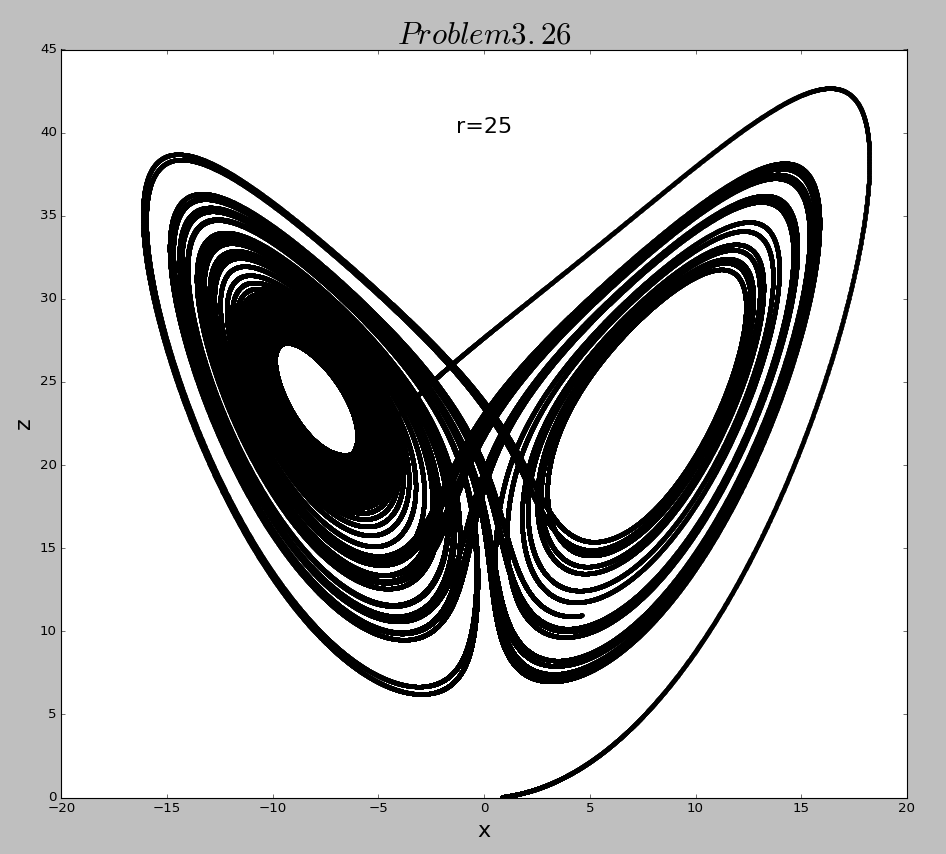
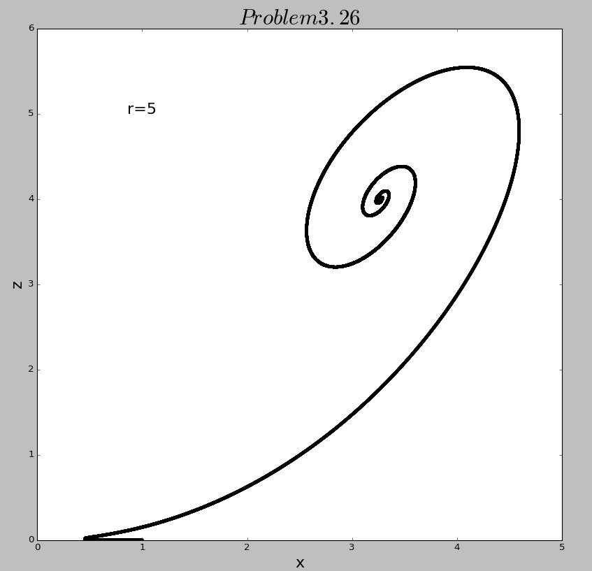
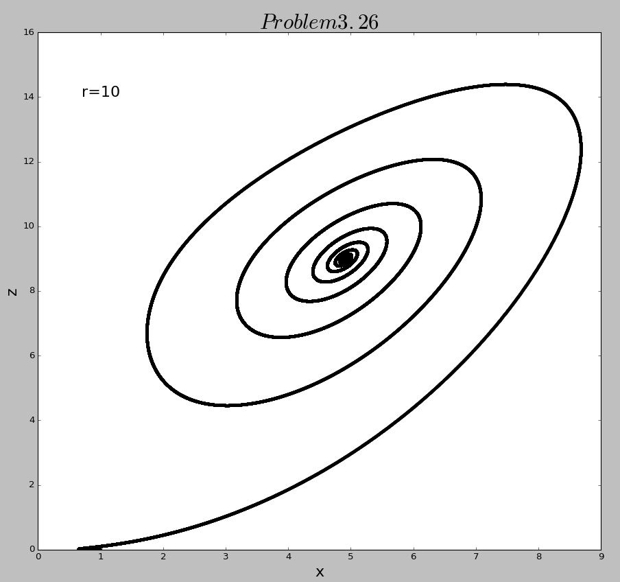
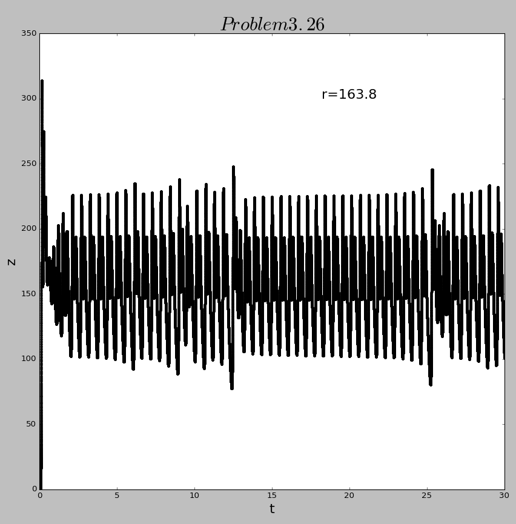
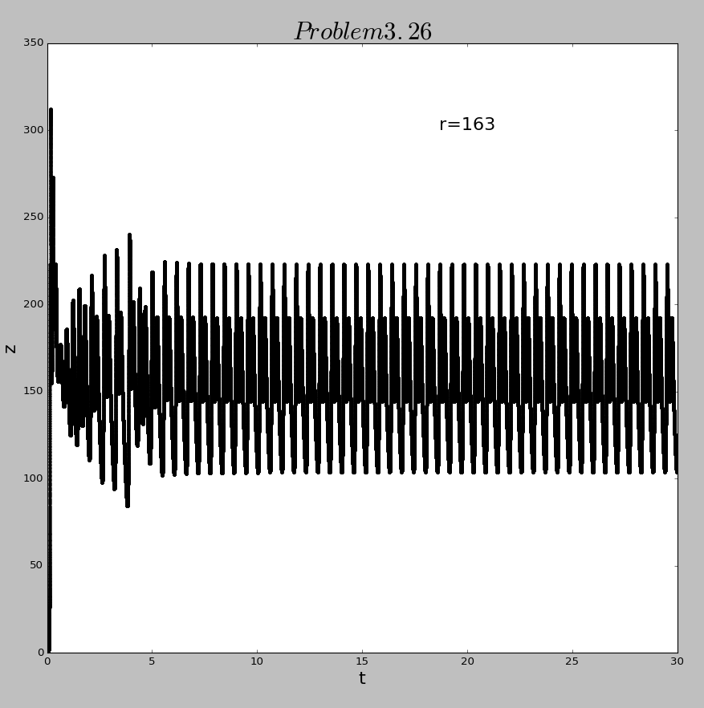
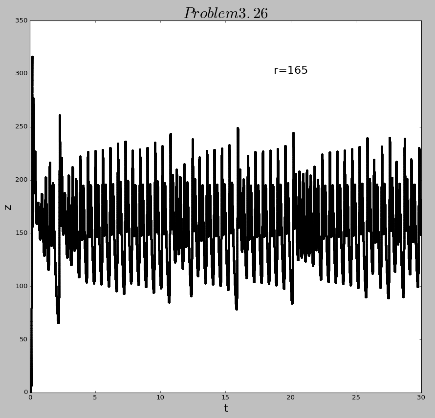

# The 10th homework

## Exercise List:

- 3.26 Continue the previous problem, and construct the phase-space plots as in Figure3.16 and 3.17 in the different regimes.

- 3.29 

## Solutions:

### 3.26 
- Here is the [**code**](code/problem3.26.py) of exercise 3.26. Below are three figure during the run time of the program. The first is the same as Figure3.16, we can find it just like two intertwined spirals which is a symbol of chaos.

  

  And the next two figure shows a evolution of the former figure with r increasing.

  
  

  So it can be easily find out that the increaing of r is a fundamental factor for chaos.

### 3.29
- The three figures below respectively shows the Lorenz variable z as a function of time, for high values of r. And approximately 163.8 seems to be a boundary between chaos and order. The fist figure is also seen in the textbook.

  

  And the following two figures are of two values of r that are near 163.8.

  
  
 
  It
