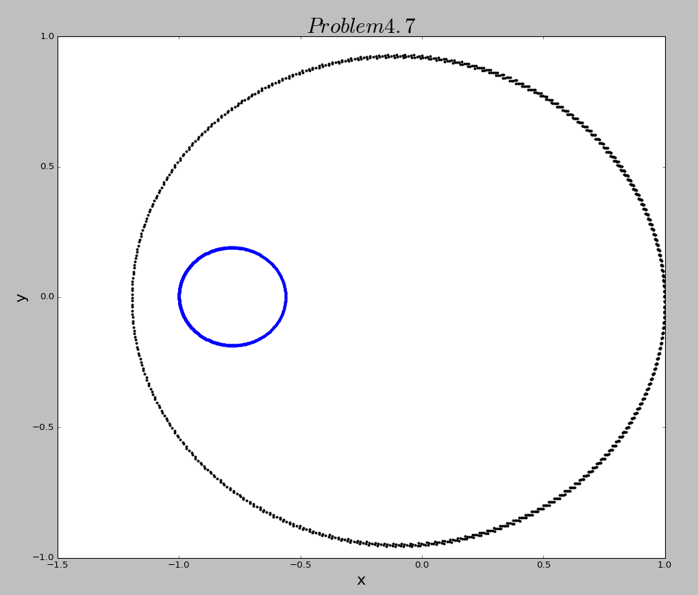
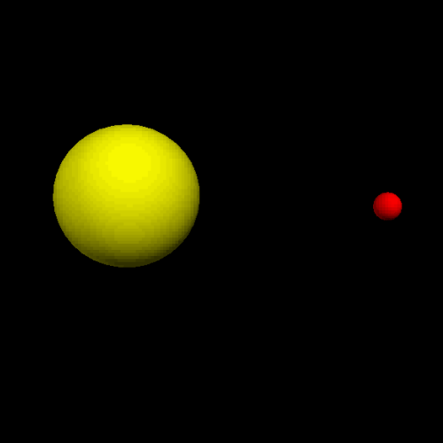
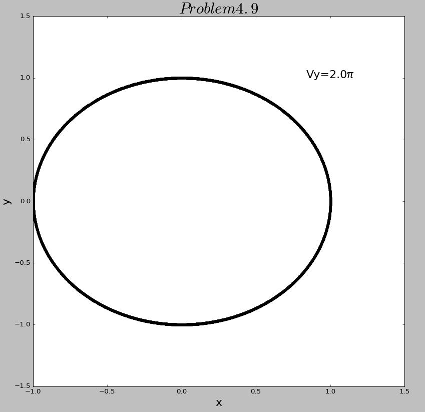
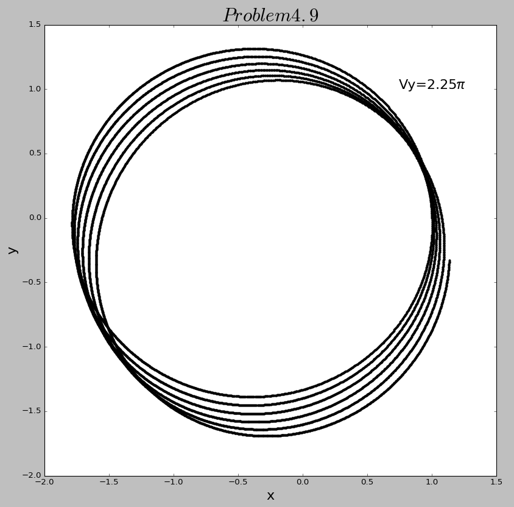
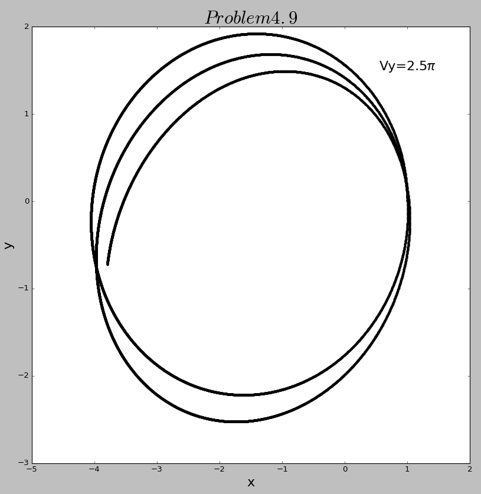
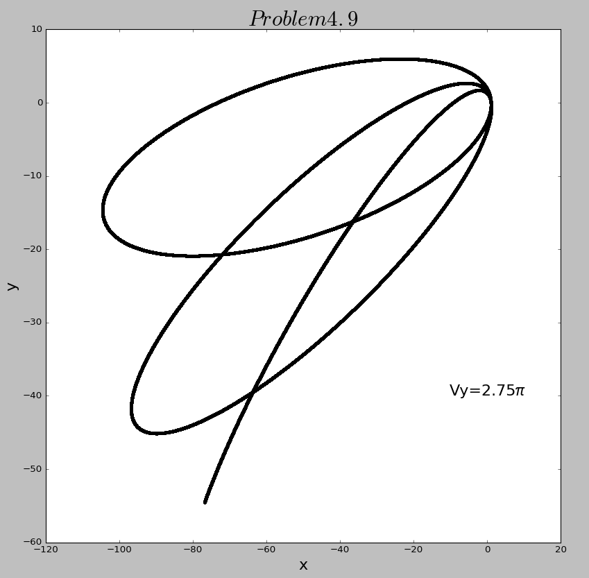

# The 11th homework

## Exercise List:

- 4.7 Consider a hypothetical solar system consisting of a sun and one planet in which yhe mass of the sun is not much greater than the mass of the planet. Now you must allow for the motion of both the planet and the sun. Extend your planetary motion program to include this effect. You will have to deal with a set of equations such as those in (4.7) for both objects. Investigate the possible types of orbital motion found in such a system. Begin with a double star system in which the two objects are of equal mass. Then explore the behavior when the masses are unequal.

- 4.9 In this section we saw that orbits are unstable for any value of β that is not precisely 2.A related question, which we did not address, is how unstable an orbit might be. That is, how long will it take for an unstable orbit to become obvious. The answer to this question depends on the nature of the orbit. If the initial velocity is chosen so as to make the orbit precisely circlular, then the value of β will make absolutely no difference. Of course, in practice it is impossible to construct an orbit that is exactly circular, so the instabilities when β≠2 will always be apparent given enough time. Even so, orbits that start out as nearly circular will remain almost stable for a longer period than those that are highly elliptical. Investigate this by studying orbits with the same value of β(say, β=2.05) and comparing he behavior with different values of the ellipticity of the orbit. You should find that the orientation of orbits are more nearly circular will rotate more slowly than those that are highly elliptical.

## Solutions:

### 4.7 
- Here is the [**code**](code/problem4.7.py) of exercise 4.7. And I also show it using VPython. Here is the [**code**](code/problem4.7_Vpython.py).
- Here is the results below.

  
  
  
### 4.9
- Here is the [**code**](code/problem4.7.py) of exercise 4.9.
- I choose some different initial velocity corresponding to different ellipticities. And here is the different orbits below.

  
  
  
  
  

