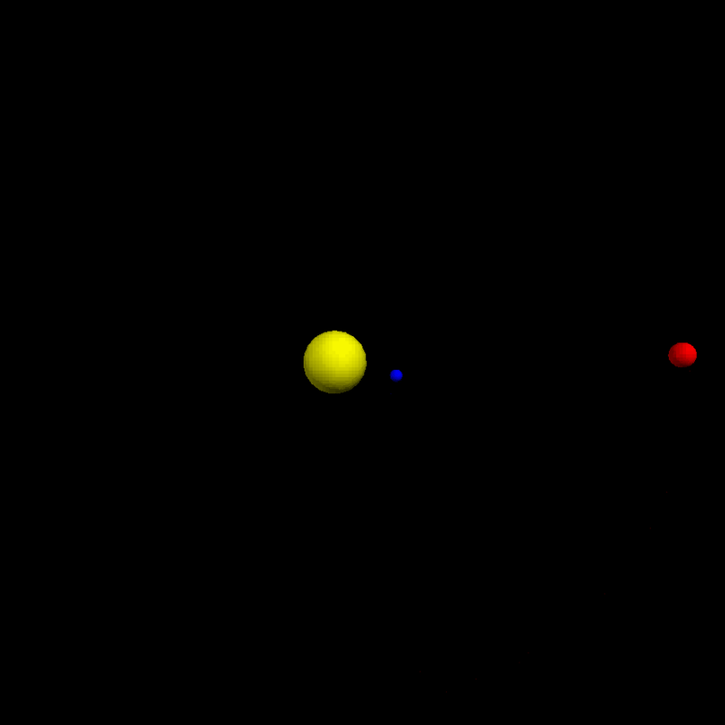
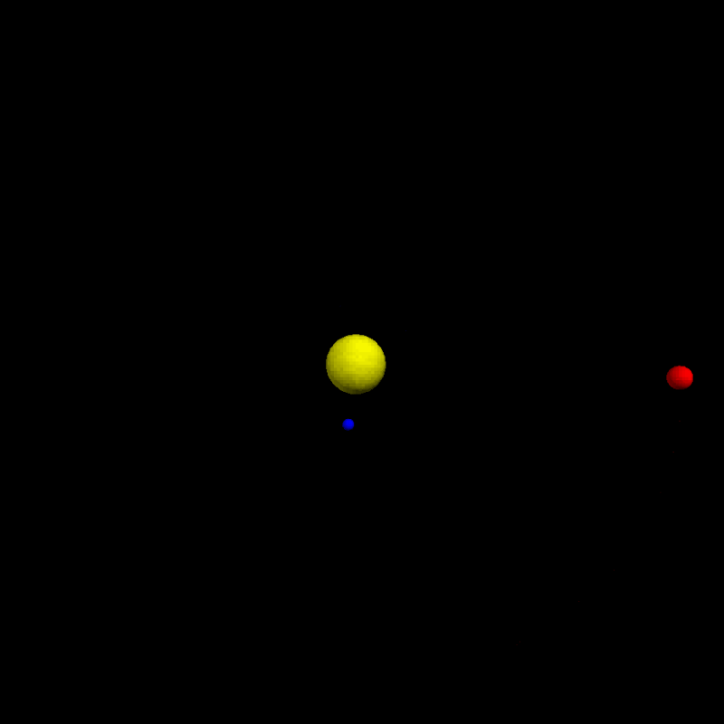
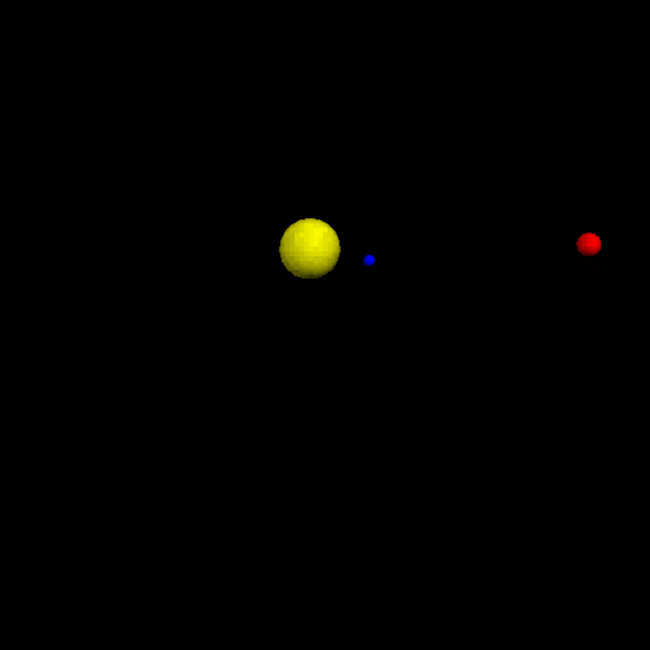
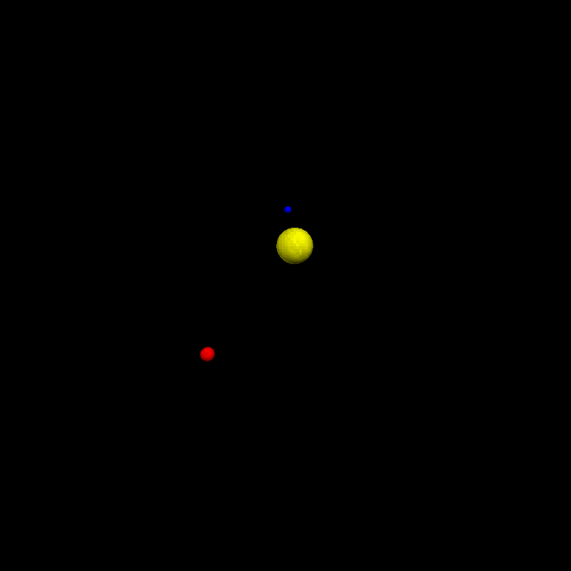
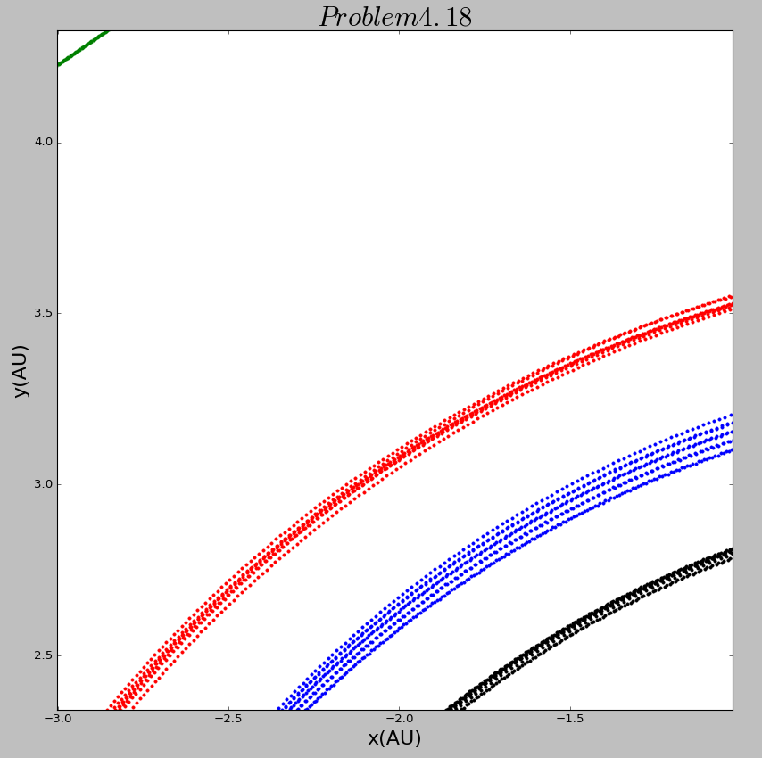
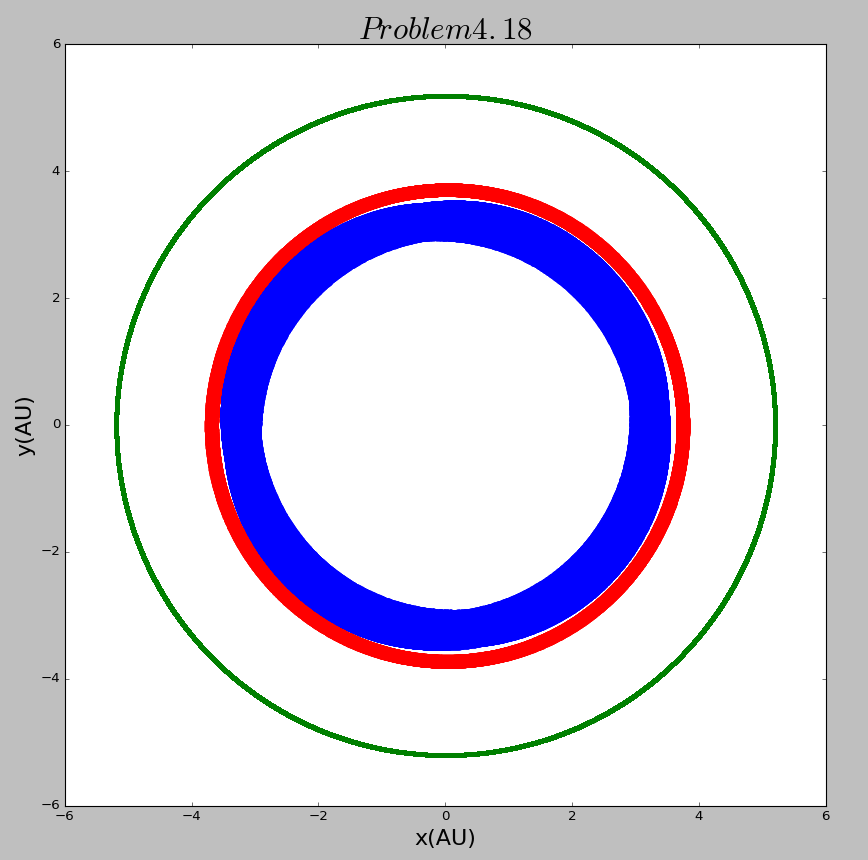
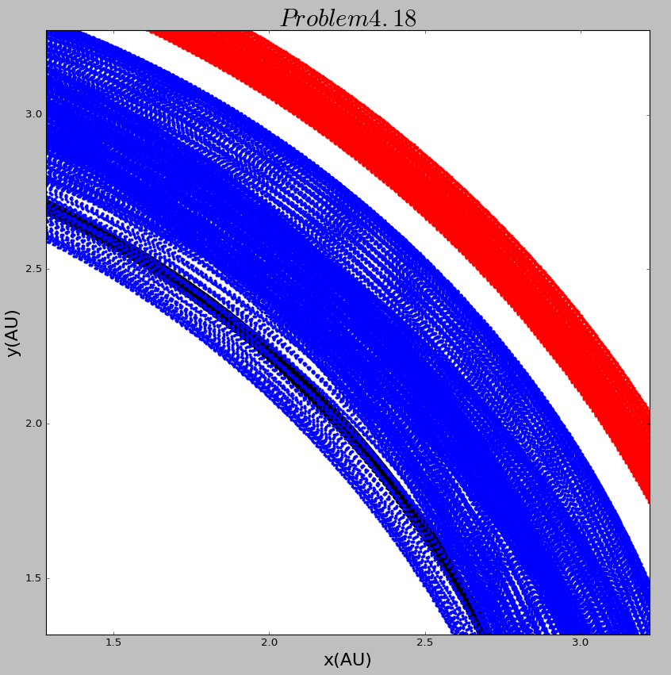
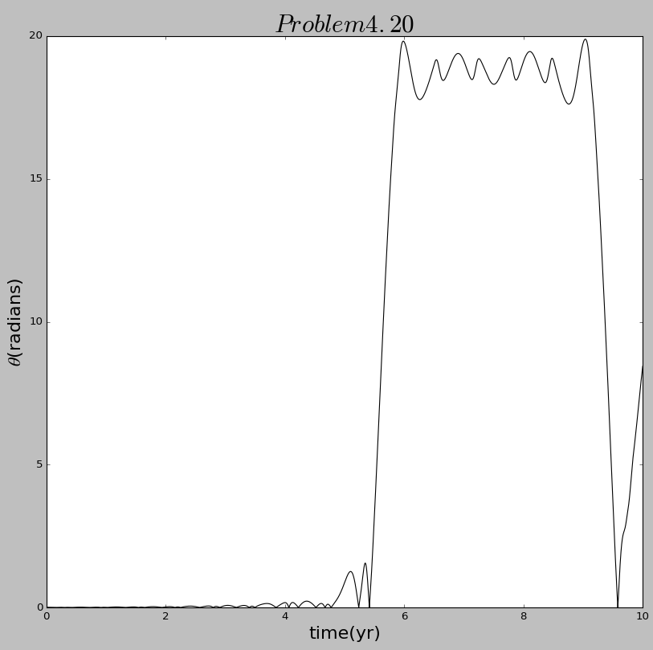

# The 12th homework

## Exercise List:

- 4.16 

- 4.18 

- 4.20

## Solutions:

### 4.16
- Here is the [**code**](code/problem4.16.py) of exercise 4.16. 

    
    
  
    
    

### 4.18
- Here is the [**code**](code/problem4.18.py) of exercise 4.18. 

    
    
  
    
    

### 4.20
- Here is the [**code**](code/problem4.20.py) of exercise 4.20. 

    
