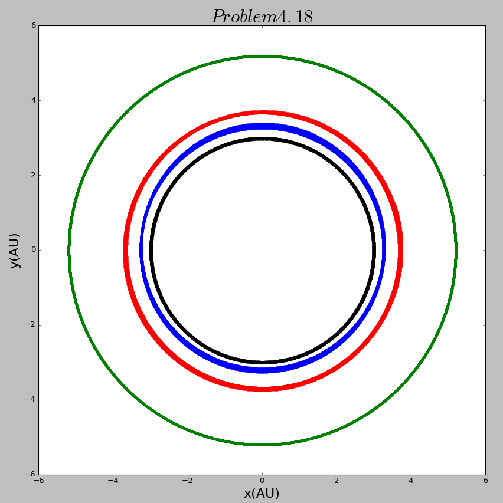

# The 12th homework

## Exercise List:

- 4.16 

- 4.18 

- 4.20

## Solutions:

### 4.16
- Here is the [**code**](code/problem4.16.py) of exercise 4.16. Here the yellow ball represents the Sun while the blue one represents the Earth and the red one represents the Jupiter.

- To show the results clearly, I've made 4 gif figures below. The 4 gifs are with different coefficients. The first is with a coefficient that represent the  true mass of Jupiter while the following 3s respectively are 10, 100, 1000 times its true mass. We can easily find the differences between the 4 figures. With Jupiter's mass growing bigger, the motion of the three planets become unstable. And even when the mass of Jupiter went to 1000 times its true mass, the Earth flew away and the Sun and the Jupiter became a two-body system.

    
    
  
    
    

### 4.18
- Here is the [**code**](code/problem4.18.py) of exercise 4.18. 

    
    
  
    
    

### 4.20
- Here is the [**code**](code/problem4.20.py) of exercise 4.20. 

    
