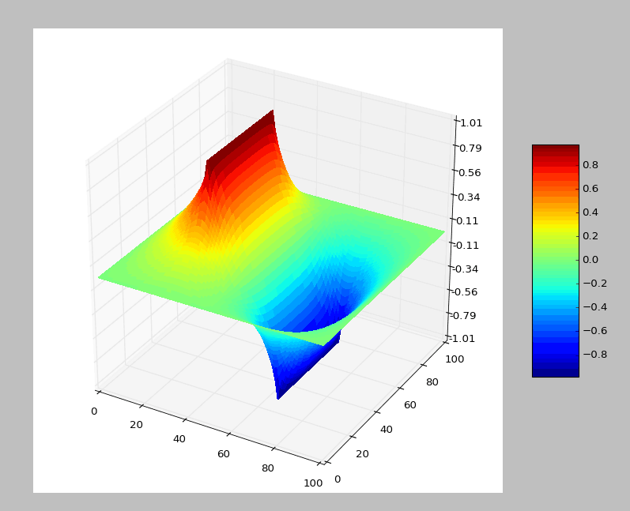
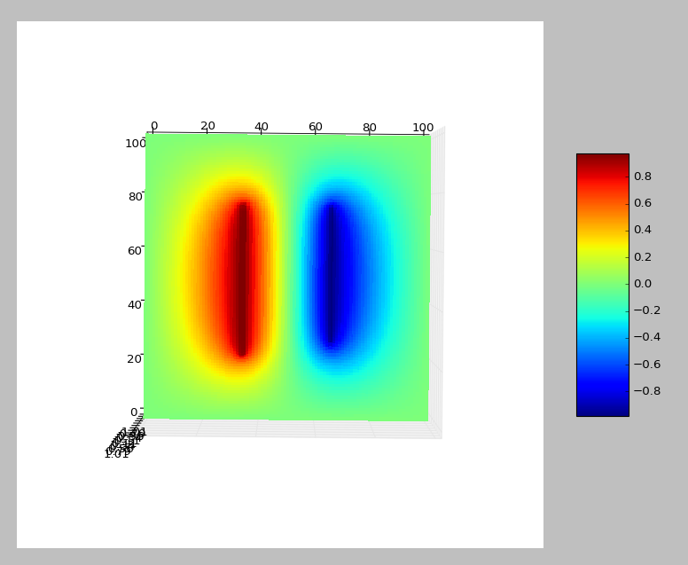
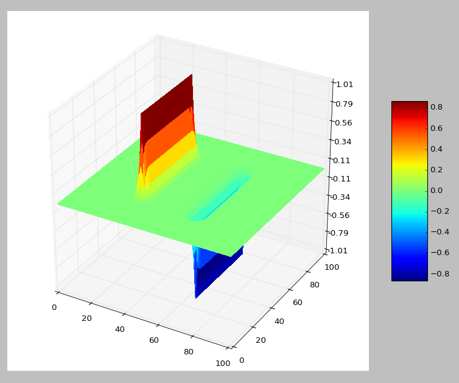
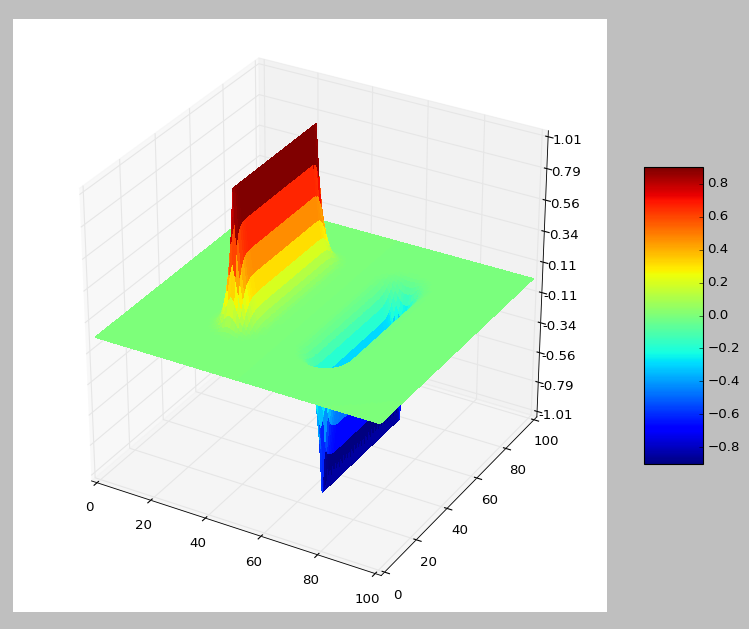
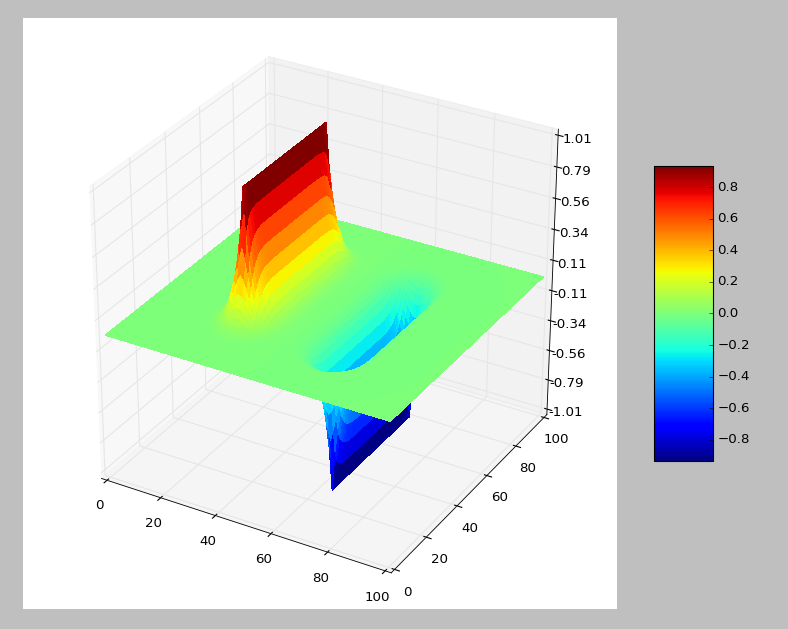
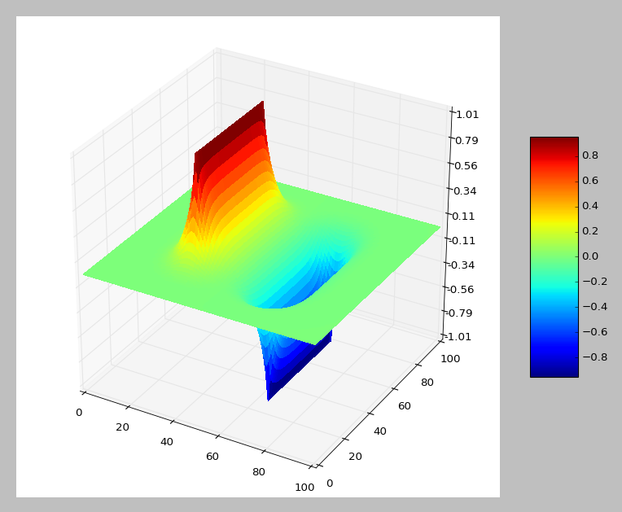
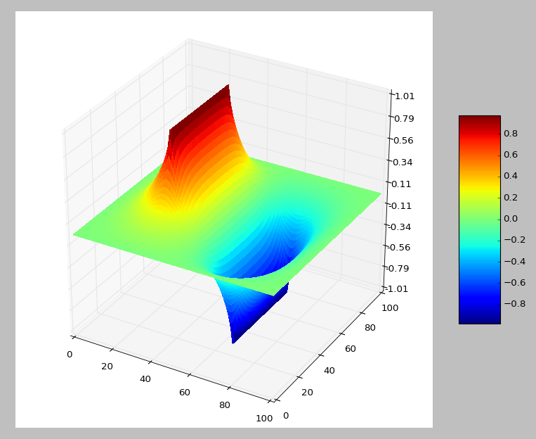
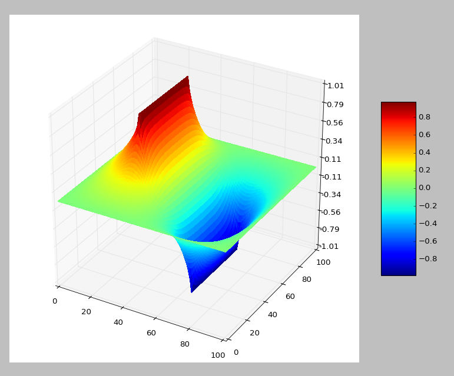
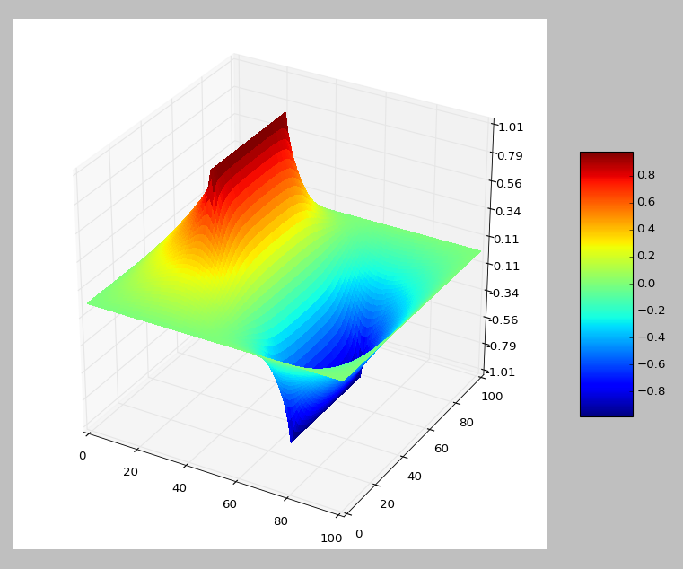
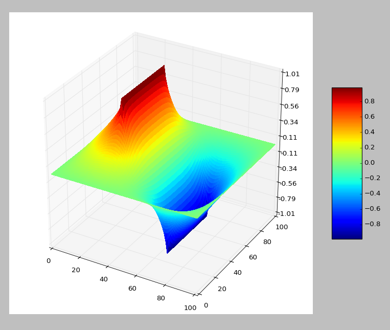

# The 13th homework

## Exercise List:

- 5.3 Use the symmetry of the capacitor problem(Figure5.6) to write a program that obtains the result by calculating the potential in only half of one quadrant of the x-y plane.

- 5.7 Write two programs to solve the capcacitor problem of Figure 5.6 and Figure 5.7, one using the Jacobi method and one using the SOR algorithm. For a fixed accuracy(as set by the convergence test) compare the number of iterations, Niter, that each slgorithm requires as a function of the number of grid elements, L. Show that for the Jacobi method Niter ~ L2, while with SOR Niter ~ L.

## Solutions:

### 5.3
- Here is the [**code**](code/problem5.3.py) of exercise 5.3.
- Here are two figures below that are exactly the same as the ones in the testbook. The former is a 3D view and the latter is a top-down view. We can see in the figure what is like that is in only one quadrant because all quadrants are here.

    
    

### 5.7
- Here is the [**code**](code/problem5.7.py) of exercise 5.7. 
- I didn't investigate the relationship between Niter and L or L2. However, I did compare the two different methods in some way. Here are 8 figures below, the left stand for the Jacobi method while the right stand for the SOR algorithm. Each row with a growing number of iterations that respectively are 10,50,500,5000. We can easily find the SOR algorithm is more optimizing comparing with the Jacobi method. However, the two methods become almost the same when Niter become bigger enough.

    
    
    
    
    
    
    
    
    
    
    
