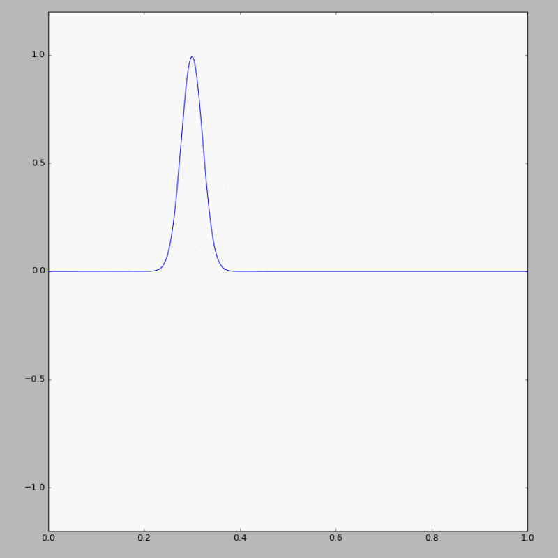
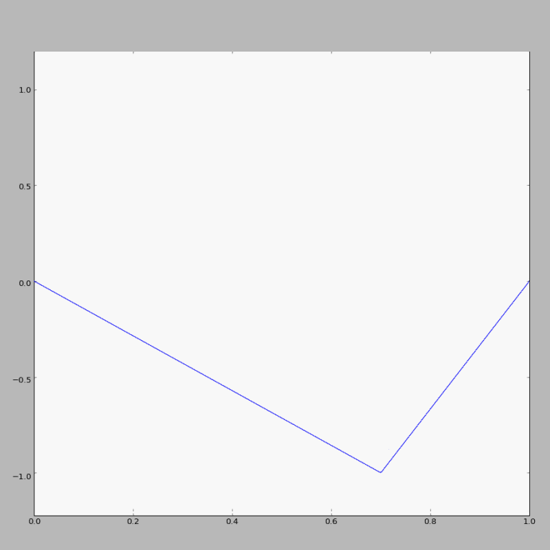
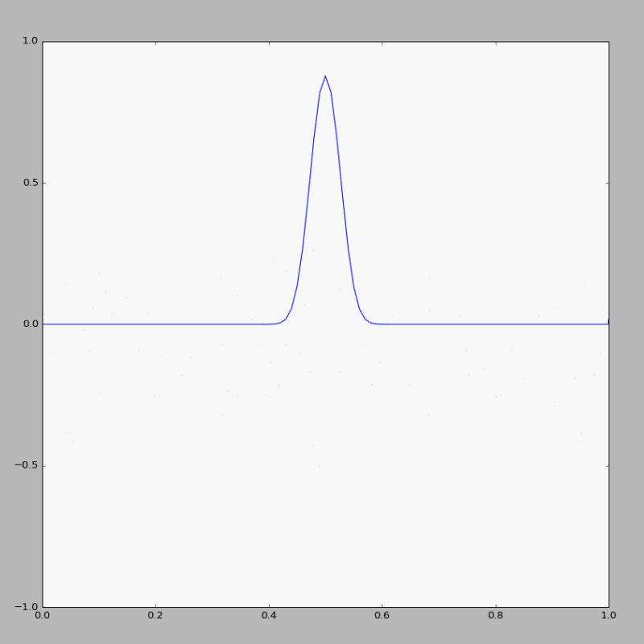
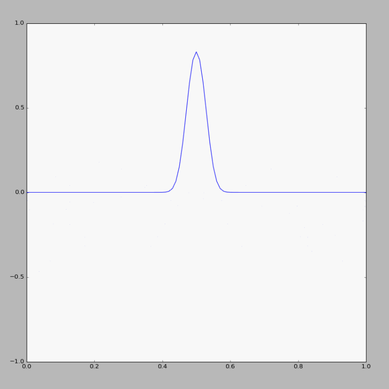
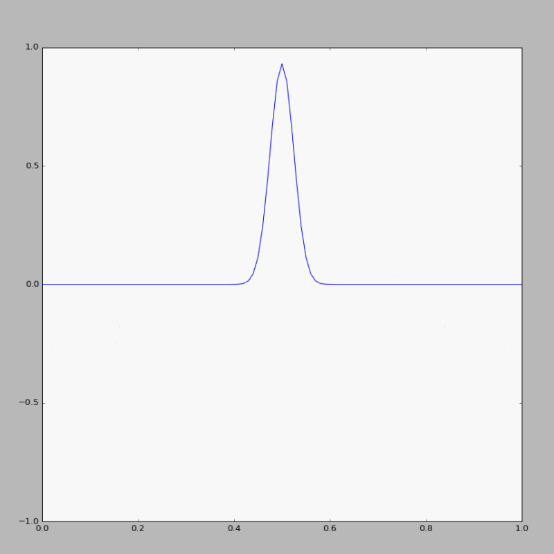

# The 14th homework

## Exercise List:

- 6.6 An important feature of a linear equation is that the sum of two solutions is also a solution. One consequence of this is that two wavepackets will travel indenpently of each other. An especially clear way to demonstrate this is to set up a string with an initial profile such that there are two Gaussian wavepackets, located at different places on the string. These wavepackets(or components of them) may then propagate toward each other and collide. Show that the wavepackets are unaffected bt these collisions. That is, show that two such wavepackets pass through each other without changing shape or speed.

- 6.12 Gaussian initial string displacement are conventient for the calculations of this section, but are not very realistic. When a real string, such as a guitar string, is plucked, the initial string displacement is more accurately described by two straight lined that start at the ends of the string(we assume fixed ends) and end at the excitation point, as illustrated in Figure6.4. Comparing the power spectrum for a string excited in this manner with the results found abouve for a Gaussian initial wavepacket.

- 6.16 Perform the calculations described in this section. One interesting possibility is to compare the size of the octave streching, that is, the magnitude of the deviation from a purely harmonic spectrum, for short(treble) and long(bass) strings.

## Solutions:

### 6.6
- Here is the [**code**](code/problem6.6.py) of exercise 6.6.
- From this figure above we can easily find that when two wavepackets pass through, they didn't change their shape or speed.

  
  
### 6.12
- Here is the [**code**](code/problem6.12.py) of exercise 6.12.
- We can compare this figure with that in problem6.6. But I don't know how to calculate the power spectrum, so I just make the figure of its motion.

  

### 6.16
- Here is the [**code**](code/problem6.16.py) of exercise 6.16.
- However, it's diiferent from those simulations in problem6.6 and problem6.12

  
  
  
  
