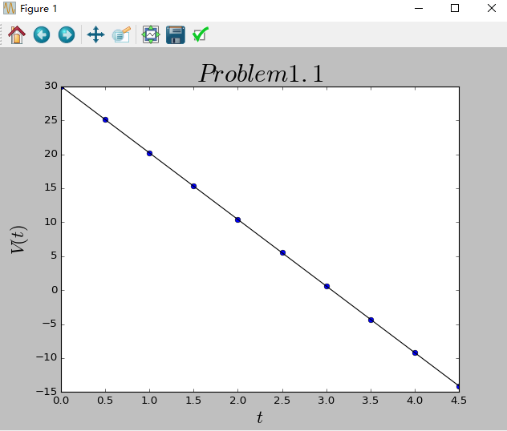
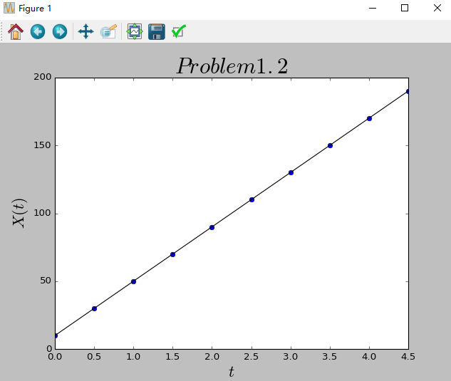
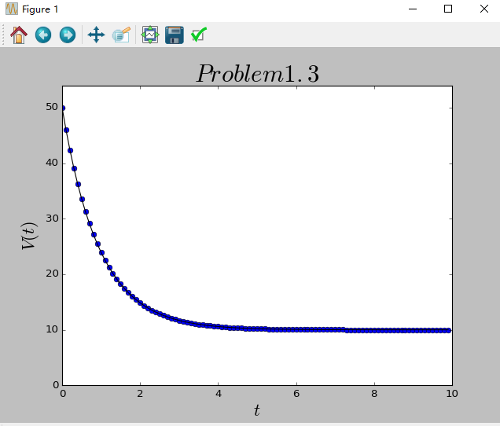
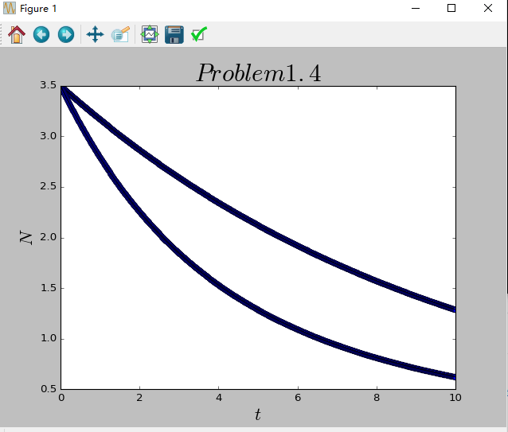
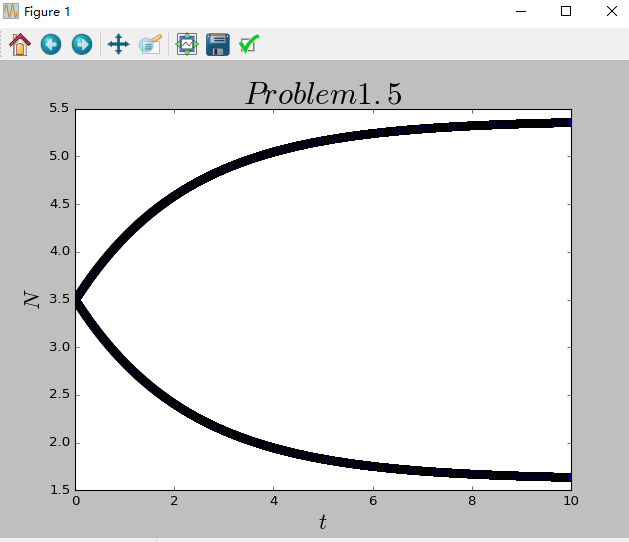
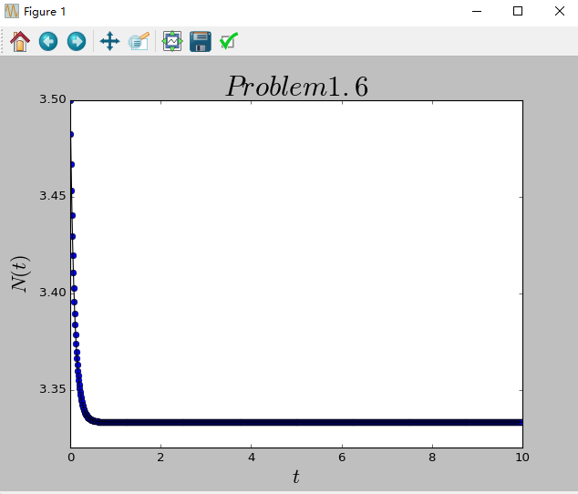

# the 4th & 5th homework

[**Problem1.1代码**](code/problem1.1.py)

[**Problem1.2代码**](code/problem1.2.py)

[**Problem1.3代码**](code/problem1.3.py)

[**Problem1.4代码**](code/problem1.4.py)

[**Problem1.5代码**](code/problem1.5.py)

[**Problem1.6代码**](code/problem1.6.py)

