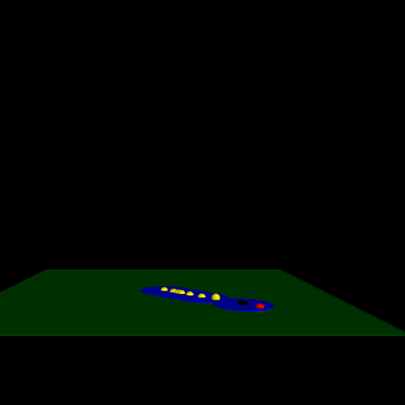

# The 6th homework

- Considering the error of velocity and launching angle, and the air friction. Use VPython to simulate the shell launching. 
- Here is the [**code**](code/shell.py)

  Here is a gif below which shows the primary motion of the shell with the initial velocity 20 and uncertainty 50%

 
