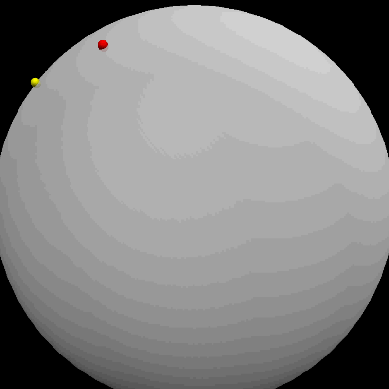

# The 7th homework

- Here is an improved program of the 6th homework which considered the geostrophic force, the error during the whole simulation, the wind resistance, and so on

- Here are the [**simulation codes**](code/VPythonMissile.py) and the final [**codes**](code/missile.py)

    
    

- After the simulation, the computer wrote the angle as a result in the controller. The results are as below.

    

    
