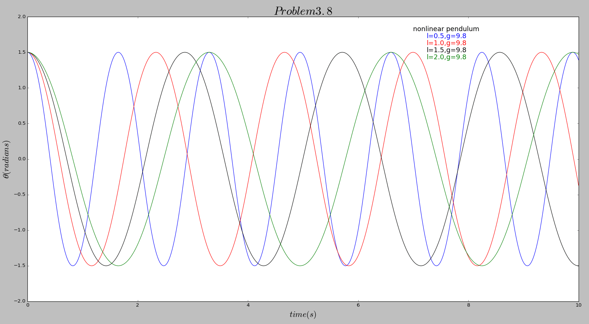

# The 8th homework

## Exercise List:

- 3.7 Numerically investigate the linear, forced pendulum with friction of the equation of motion

 ,

 Show numerically the existence of the resonance, and confirm the dependence of the resonant amplitude on the driving angular frequncy Ω.

- 3.8 In the nonlinear pendulum of the equation of motion

  ,

 Use Euler-Cromer or another suitable method to investigate the relationship between the amplitude and period numerically.Can you give an intuitive argument supporting your results?

## Solutions:

### Exercise 3.7

- To be simple and clear, I write the first [**code**](code/problem3.7_1.py) to compare the 4 different situations. And here is the image of this program below.

  

- As we can see, this picture shows us a very deirct version of the change of the amplitude and period because of the change of the driving angular frequency Ω. From the image we can easily find that the driving angular frequency Ω and the amplitude are not a linear relationship. But still we can get imformation from the image. When the driving angular frequency Ω is close to the value of π(maybe 3.0 as an approximate), the final amplitude is the biggist. And on the other hand, the pendulum is much stable when the driving angular frequency Ω is about 2.0.

- And also, the amplitude is depending on the friction parameter q. Here is another image below which shows the relationship between q and the amplitude.

  
 
- Here we can see the friction parameter q and the amplitude are a linear relationship, which means the bigger q is, the bigger the amplitude is. And also, when q=1.0, the curveis turns out to be the most stable one.

### Exercise 3.8

- As a common sense, when l become smaller, the period become smaller, too. We can easily find this rule from the image below. Here 4 curves with 4 different q has been given.

  
