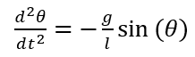

# The 8th homework

## Exercise List:

- 3.7 Numerically investigate the linear, forced pendulum with friction of the equation of motion

 ,

 Show numerically the existence of the resonance, and confirm the dependence of the resonant amplitude on the driving angular frequncy

- 3.8 In the nonlinear pendulum of the equation of motion

  ,

 Use Euler-Cromer or another suitable method to investigate the relationship between the amplitude and period numerically.Can you give an intuitive argument supporting your results?

## Solutions:

- 3.7 To be simple and clear, I write the first [**code**](code/problem3.7_1.py) to compare the 4 different situations. And here is the image of this program below.

  
