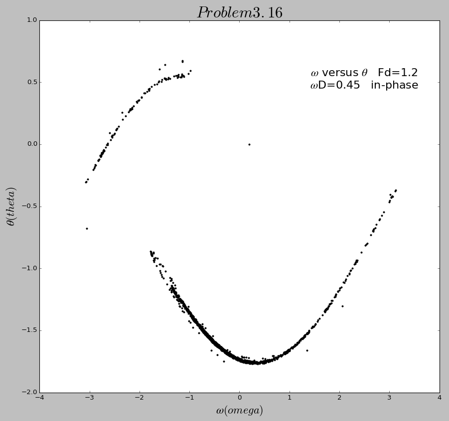
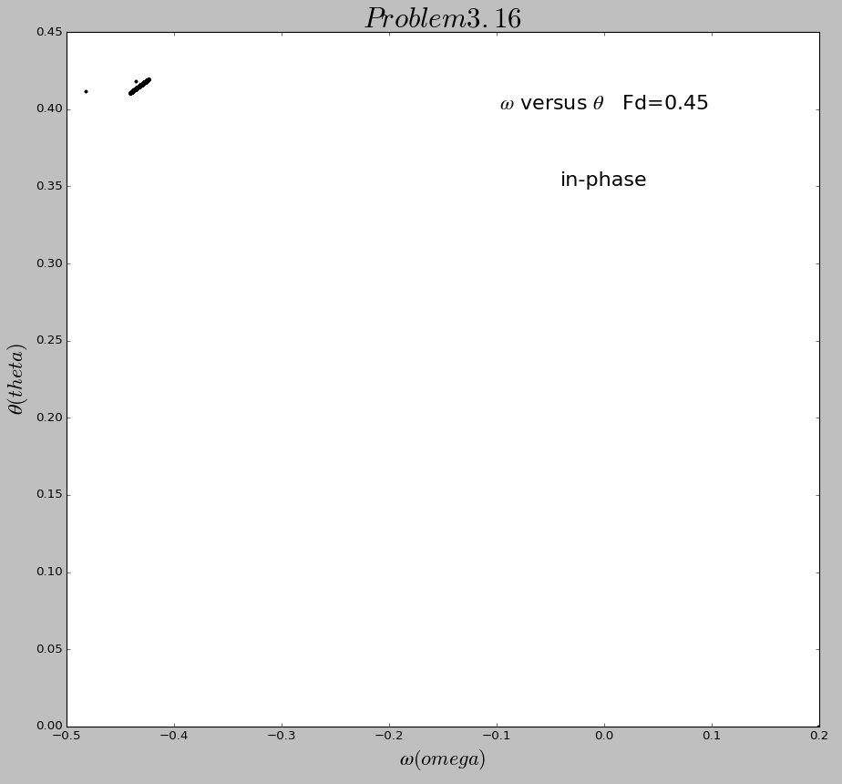

# The 9th homework

## Exercise List:

- 3.12 In constructing the Poincare section in Figure3.9 we plotted points only at times that were in phase with the drive force; that is, at times t≈2πn/ΩD, where n is an integer. At these values of t the driving force passed through zero. However, we could just as easily have chosen to make the plot at times corresponding to a maximum of the drive force, or at times π/4 out-of-phase with this force, etc. Construct the Poincare sections for these cases and compare them with Figure3.9.

- 3.16 Investigate how a strange attractor is altered by small changes in one of the pendulum parameters. Begin by calculating the strange attractor in Figure3.9. Then change either the drive amplitude or drive frequency by a small amount and observe the changes in the attractor.

## Solutions:

### 3.12
- Here is the [**code**](code/problem3.12.py). And here is the in-phase figure below:

  

  However, when I change the phase of the driven force, it has shown some changes as below:
 
  
  

  We can easily see the gradual change of the figure, which shows that that the strange attracor is changing slowly and with phase changing. But the shape of these three figure is approximately in the same pattern.

### 3.16
- Here is the [**code**](code/problem3.16.py). I change the value of FD and ΩD. Here is the fugure below:

  
  
