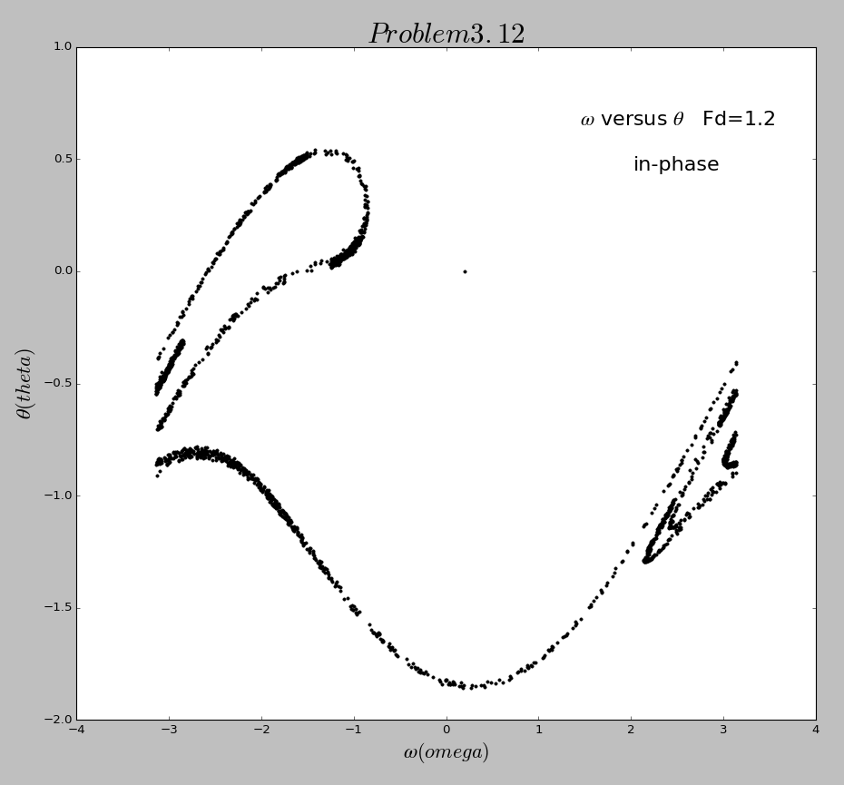
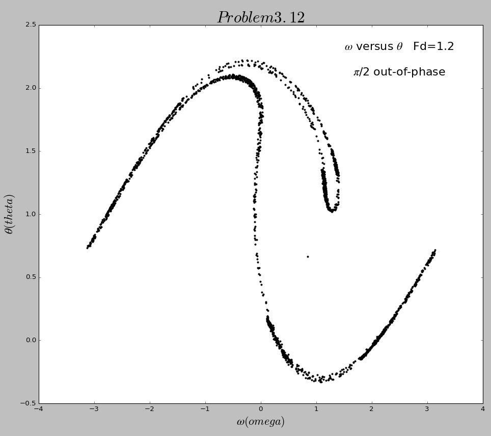
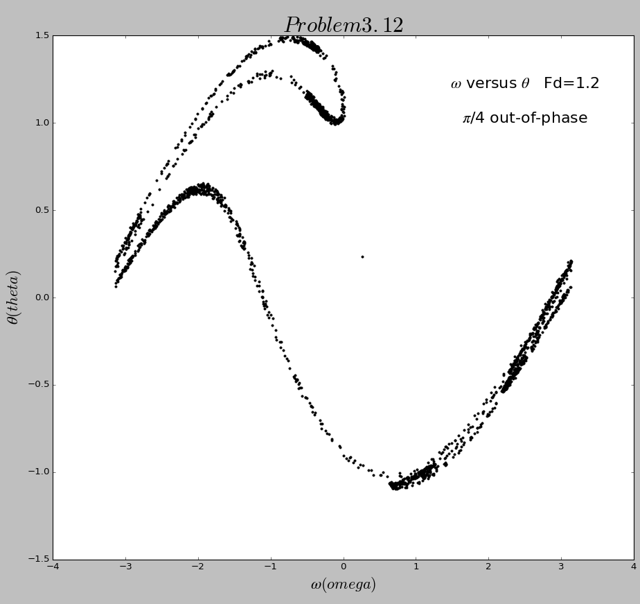

# The 9th homework

## Exercise List:

- 3.12 In constructing the Poincare section in Figure3.9 we plotted points only at times that were in phase with the drive force; that is, at times t≈2πn/Ω_D, where n is an integer. At these values of t the driving force passed through zero. However, we could just as easily have chosen to make the plot at times corresponding to a maximum of the drive force, or at times π/4 out-of-phase with this force, etc. Construct the Poincare sections for these cases and compare them with Figure3.9.

- 3.16 In the nonlinear pendulum of the equation of motion
 Use Euler-Cromer or another suitable method to investigate the relationship between the amplitude and period numerically.Can you give an intuitive argument supporting your results?

## Solutions:

### 3.12
- Here is the [**code**](code/problem3.12.py). And here is the in-phase figure below.
    
  However when I change the 
  
  

### 3.16
- 
